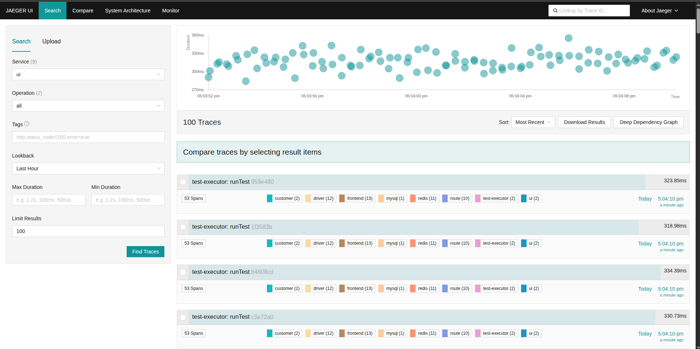
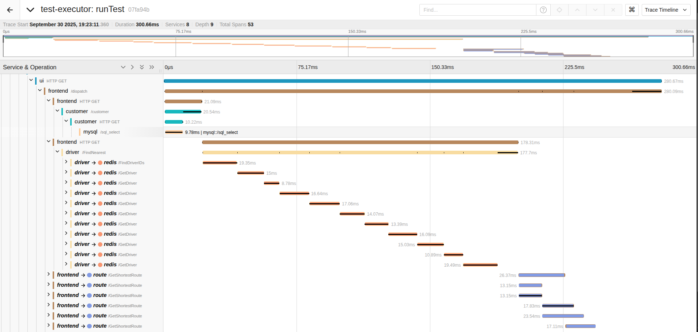
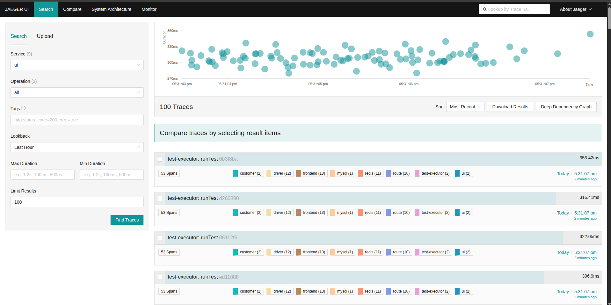
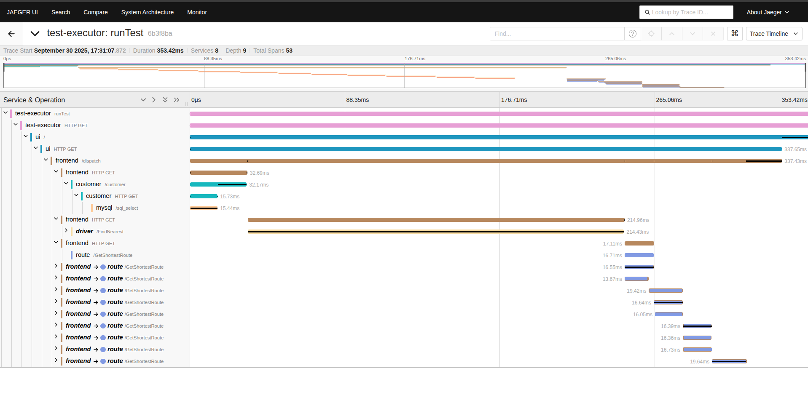
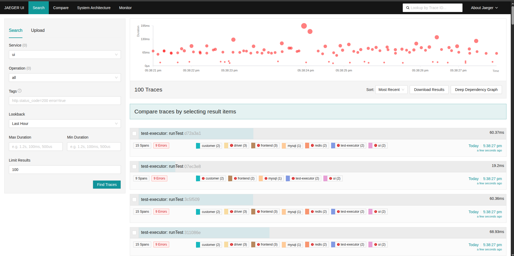
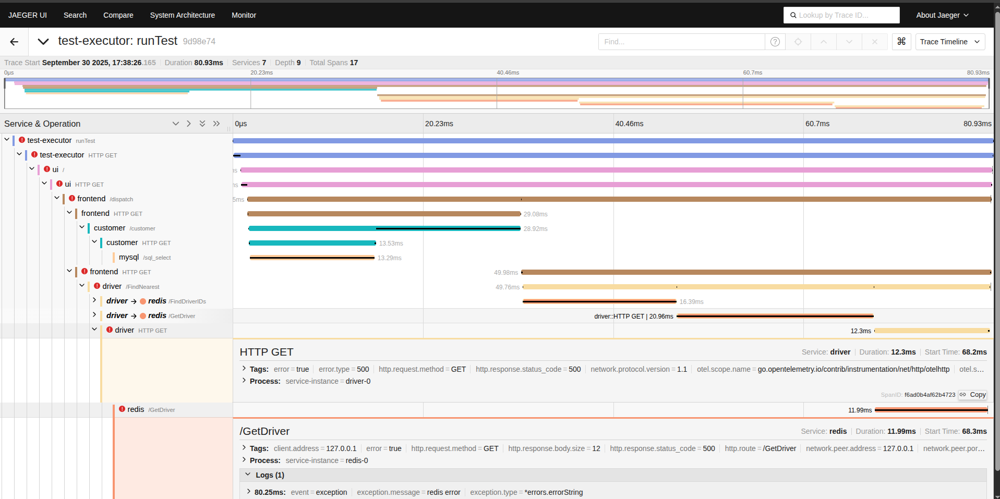
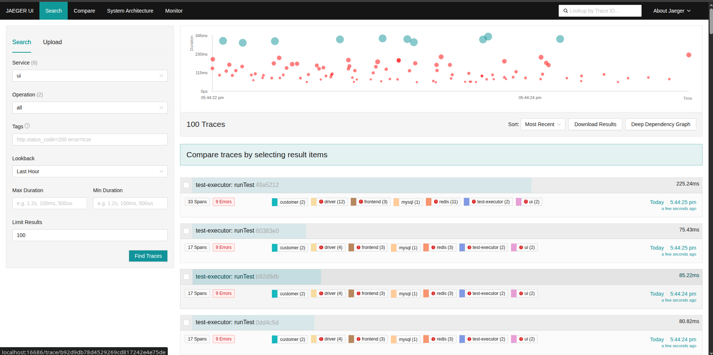
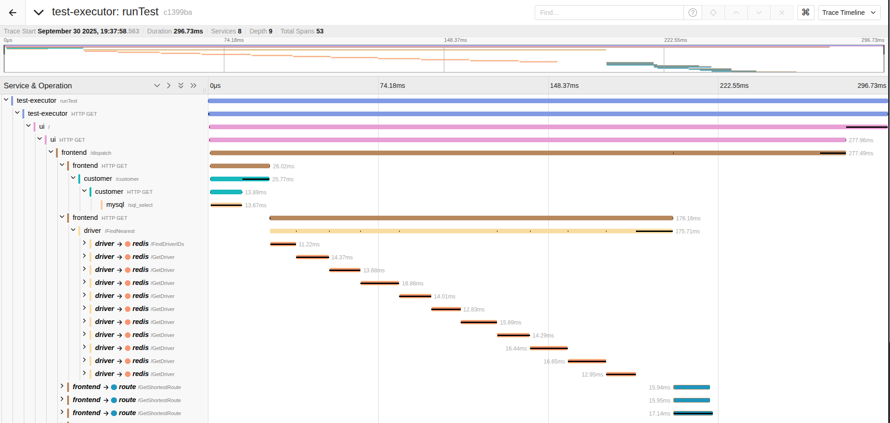

# Simulation of Microservices Architecture with Microsim 

# Introduction 

Modern software systems increasingly rely on **microservices architectures**, where applications are decomposed into small, independent services. This approach improves scalability, maintainability, and fault isolation, but it also introduces new challenges in terms of **performance monitoring**, **fault tolerance**, and **system complexity**.

To study these challenges in a controlled and safe environment, we can use a simulator rather than deploying a full production system, which would be both risky and costly. One such tool is **Microsim**.

Microsim enables us to model a microservice architecture through a JSON configuration. Once the architecture is defined, we can conduct various experiments, such as increasing workload, introducing failures, or simulating different conditions. The simulator produces **execution traces**, which provide a detailed record of system behavior under these conditions.

These traces can then be exported to **Jaeger**, an open-source distributed tracing platform originally developed by Uber and now part of the Cloud Native Computing Foundation. Using Jaeger, we can visualize the flow of requests across services, measure latency at each stage, and identify bottlenecks or points of failure.

By combining Microsim and Jaeger, we create a powerful environment for studying microservices. This approach allows us not only to observe that a problem has occurred, but also to trace where and why it happened, providing critical insights into the performance and reliability of complex distributed systems.

## Microsim 
Microsim is a microservice simulator designed to generate synthetic distributed traces from a user-defined architecture. The simulator relies on a configuration file where users specify services, their instances, endpoints, and inter-service dependencies. Once defined, Microsim spawns multiple workers that generate requests starting from a root service and propagating across the dependency graph. During execution, random variations are introduced: for example, request latencies are sampled from a normal distribution defined by mean and standard deviation, and error rates can also be specified. This enables the exploration of system dynamics in a fully controlled environment. By default, traces are exported in **OpenTelemetry** format to an OTLP endpoint, making them compatible with a range of observability platforms. Microsim also includes prebuilt configurations (e.g., Jaeger’s HotROD demo), which facilitate quick experimentation and visualization of distributed traces. 

## Jaeger
Jaeger's primary purpose is to collect, store, and visualize traces of requests as they propagate through a distributed architecture. Jaeger supports essential observability features, including context propagation, root cause analysis, service dependency analysis, and latency optimization. 
With the adoption of OpenTelemetry, Jaeger has introduced native support for ingesting traces in the OTLP (OpenTelemetry Protocol) format. This allows it to integrate seamlessly not only with simulators such as Microsim, but also with production-grade applications that are instrumented using OpenTelemetry libraries.
Its web-based UI enables interactive exploration of traces, making it possible to identify bottlenecks, cascading failures, and anomalies in request flows. 

# Initial Configuration

The starting point is a simplified microservices-based architecture based on the **HotROD (Rides on Demand)** demo application.
This architecture is described in a JSON file, where each service, endpoint and dependency is explicitly defined.

```json
{
  "Services": [
    {
      "Name": "ui",
      "Endpoints": [
        {
          "Name": "/",
          "Depends": {
            "Service": {
              "Name": "frontend",
              "Endpoint": "/dispatch"
            }
          }
        }
      ]
    },
    {
      "Name": "frontend",
      "Endpoints": [
        {
          "Name": "/dispatch",
          "Depends": {
            "Seq": [
              {
                "Service": {
                  "Name": "customer",
                  "Endpoint": "/customer"
                }
              },
              {
                "Service": {
                  "Name": "driver",
                  "Endpoint": "/FindNearest"
                }
              },
              {
                "Par": {
                  "Items": [
                    {
                      "Service": {
                        "Name": "route",
                        "Endpoint": "/GetShortestRoute"
                      }
                    },
                    {
                      "Service": {
                        "Name": "route",
                        "Endpoint": "/GetShortestRoute"
                      }
                    },
                    {
                      "Service": {
                        "Name": "route",
                        "Endpoint": "/GetShortestRoute"
                      }
                    },
                    {
                      "Service": {
                        "Name": "route",
                        "Endpoint": "/GetShortestRoute"
                      }
                    },   
                  ],
                  "MaxPar": 3
                }
              }
            ]
          }
        }
      ]
    },
    {
      "Name": "customer",
      "Endpoints": [
        {
          "Name": "/customer",
          "Depends": {
            "Seq": [
              {
                "Service": {
                  "Name": "mysql"
                }
              }
            ]
          }
        }
      ]
    },
    {
      "Name": "driver",
      "Endpoints": [
        {
          "Name": "/FindNearest",
          "Depends": {
            "Seq": [
              {
                "Service": {
                  "Name": "redis",
                  "Endpoint": "/FindDriverIDs"
                }
              },
              {
                "Service": {
                  "Name": "redis",
                  "Endpoint": "/GetDriver"
                }
              },
              {
                "Service": {
                  "Name": "redis",
                  "Endpoint": "/GetDriver"
                }
              },
              {
                "Service": {
                  "Name": "redis",
                  "Endpoint": "/GetDriver"
                }
              },
            ]
          }
        }
      ],
      "Count": 2
    },
    {
      "Name": "route",
      "Endpoints": [
        {
          "Name": "/GetShortestRoute"
        }
      ],
      "Count": 3
    },
    {
      "Name": "mysql",
      "Endpoints": [
        {
          "Name": "/sql_select"
        }
      ]
    },
    {
      "Name": "redis",
      "Endpoints": [
        {
          "Name": "/FindDriverIDs"
        },
        {
          "Name": "/GetDriver" 
        }
      ]
    }
  ],
  "TestName": "baseline",
  "TestDuration": 30,
  "TestRunners": 2,
  "Repeats": 100,
  "SleepBetweenRequests": 50
}
```

# Defined Services

## UI Service
- **Role**: Entry point of the system, representing the user interface.  
- **Endpoint**: `/`  
- **Behavior**: Forwards incoming user requests to the **Frontend** service (`/dispatch`).  


## Frontend Service
- **Role**: Core orchestrator coordinating customer data retrieval, driver discovery, and route calculation.  
- **Endpoint**: `/dispatch`  
- **Dependencies**:  
  1. **Customer Service** → Calls `/customer` to fetch customer information from the database.  
  2. **Driver Service** → Calls `/FindNearest` to identify the closest available drivers.  
     - The Driver service itself interacts with **Redis** to fetch driver details.  
  3. **Route Service** → Calls `/GetShortestRoute` in **parallel**, with up to **3 concurrent requests**.  
     - Models real-world route computation where multiple alternative paths are evaluated simultaneously.  


## Customer Service
- **Role**: Provides customer profile and request-related information.  
- **Endpoint**: `/customer`  
- **Dependencies**: **MySQL Service** (`/sql_select`), simulating a database query.  


## Driver Service
- **Role**: Responsible for locating and returning available drivers near the customer.  
- **Endpoint**: `/FindNearest`  
- **Dependencies**:  
  1. **Redis** → `/FindDriverIDs` to obtain candidate driver IDs.  
  2. **Redis** → Multiple calls to `/GetDriver` to fetch individual driver details (e.g., location, availability).  
- **Scaling**: Two instances of the driver service are simulated (`Count: 2`), modeling horizontal scaling for load distribution.  


## Route Service
- **Role**: Provides shortest-route calculation.  
- **Endpoint**: `/GetShortestRoute`  
- **Scaling**: Three instances of the route service (`Count: 3`).  


## MySQL Service
- **Role**: Simulates a relational database storing customer-related data.  
- **Endpoint**: `/sql_select`   


## Redis Service
- **Role**: In-memory cache to accelerate access to driver-related data.  
- **Endpoints**:  
  - `/FindDriverIDs` → Returns IDs of drivers in proximity.  
  - `/GetDriver` → Returns detailed driver information.   


## Performance Parameters
Within each endpoint you can specify how it behaves under load:

- **Perf**:
  - **Latency** → artificial delay added to each call. You can define:
    - Distribution type (e.g., "normal")
    - Mean latency (ms)
    - Standard deviation (ms)

  - **Failure** → probability of errors.
    - Probability: number between 0 and 1.
    - Messages: possible error messages returned.

These allow you to simulate non-ideal conditions, like slow services or random failures.


## Workload Parameters

The workload configuration specifies how the system is stressed during a test. The key parameters are:

- **TestDuration**: total duration of the experiment.
- **TestRunners**: number of parallel threads generating requests.
- **Repeats**: how many times each runner repeats the sequence.
- **SleepBetweenRequests**: pause between requests (in ms).


# Test Scenarios

Four main scenarios have been defined to evaluate the behavior of the microservices architecture under different conditions. Each scenario modifies the workload or service parameters to test specific aspects such as latency, concurrency, fault tolerance, and scaling.

| Scenario Name      | Duration (s) | Runners | Repeats | Sleep (ms) | Total Requests | QPS (approx) | Objective |
|-------------------|-------------|---------|---------|------------|----------------|---------------|-----------|
| **Baseline**       | 30          | 2       | 100     | 50         | 200            | 6.7           | Validate normal behavior under light load. |
| **Stress Test**    | 90          | 10      | 1000    | 10         | 10,000         | 111.1         | Test the system under very high load. |
| **Fault Injection**| 30          | 2       | 100     | 50         | 200            | 6.7           | Simulate failures in Redis and MySQL. |
| **Scaling**        | 45          | 8       | 100     | 50         | 800            | 17.8          | Examine behavior with increased number of service instances and workers. |


### Scenario Descriptions

1. **Baseline**  
   - Purpose: Establish a reference point for normal system operation.  
   - Light load, minimal concurrency, no simulated failures.

2. **Stress Test**  
   - Purpose: Assess performance under high request volume and concurrency.  
   - Many test runners issue requests rapidly, simulating peak usage conditions.

3. **Fault Injection**  
   - Purpose: Test system resilience when some services occasionally fail.  
   - Failure probabilities configured:  
     - **Redis `/GetDriver`** → 60% failure rate.  
     - **MySQL `/sql_select`** → 20% failure rate.  

4. **Scaling**  
   - Purpose: Understand how adding service instances affects throughput and latency.  
   - Increased number of runners or service replicas while keeping request volume per runner small.


These scenarios allow us to systematically explore the system’s performance, identify bottlenecks, and understand the propagation of delays or failures across service dependencies.


# Execution of Experiments

The experiments were automated using a script that iterated through the different scenarios and executed Microsim with the corresponding JSON configuration files.
The overall workflow followed these steps:

1. **Starting Jaeger**  
  Jaeger was started with a `docker-compose.yml` file configured as follows:
```yaml
  services:
    jaeger:
      image: jaegertracing/all-in-one:latest
      container_name: jaeger
      ports:
        - "16686:16686"  # Jaeger UI
        - "4317:4317"    # OTLP gRPC
        - "4318:4318"    # OTLP HTTP
      networks:
        - msim-net
networks:
  msim-net:
    driver: bridge
```
This setup exposes the Jaeger UI on port 16686 and provides OTLP endpoints (4317 and 4318) to receive traces from Microsim.

2. **Running Microsim**  
  Microsim was executed through a custom script:
```bash
#!/bin/bash
set -euo pipefail

SCENARIOS=("default_config" "high_latency" "stress_test" "fault_injection" "scaling")

mkdir -p outputs

for s in "${SCENARIOS[@]}"; do
    CFG="./config/${s}.json"
    
    # Read parameters from the JSON using jq
    W=$(jq -r '.TestRunners // 3' "$CFG")
    R=$(jq -r '.Repeats // 0' "$CFG")
    D=$(jq -r '.TestDuration // "10s"' "$CFG")
    D="${D}s"
    S=$(jq -r '.SleepBetweenRequests // "100ms"' "$CFG")
    S="${S}ms"

    echo "=== Running scenario: $s ==="

    docker run --rm \
        --network code_msim-net \
        -v "$(pwd)/config":/config \
        -e OTEL_EXPORTER_OTLP_ENDPOINT=http://jaeger:4318 \
        -e OTEL_EXPORTER_OTLP_INSECURE=true \
        yurishkuro/microsim \
        -c /config/$(basename "$CFG") \
        -w "$W" \
        -r "$R" \
        -d "$D" \
        -s "$S" \
        > outputs/microsim_${s}.log 2>&1

    echo "=> finished: outputs/microsim_${s}.log"
    sleep 5
done
```
### Key points of the script:

- **Parameters (TestRunners, Repeats, Duration, SleepBetweenRequests)** were dynamically extracted from each JSON file using jq.
- **Microsim Execution**: each run was executed inside a container connected to the Jaeger network (code_msim-net).
- **Trace Export**: traces were exported to Jaeger via the environment variable
`OTEL_EXPORTER_OTLP_ENDPOINT=http://jaeger:4318`.
- **Logs**: outputs were redirected to individual log files in the outputs/ folder (e.g., microsim_stress_test.log).

### Collecting Results

- **Traces** were visualized in the [Jaeger UI](http://localhost:16686) for each scenario.
  - Filtering by service name (e.g., ui, frontend, redis).
  - Inspecting individual spans for latency and errors.

This setup ensured a controlled environment where only the configuration JSON changed between scenarios, making results consistent and comparable.


# Results 

## Baseline 
- **Objective**: validate normal system behavior under light load.
- **Observations**:
  - All service calls executed correctly.
  - Low latency across all endpoints.
  - No failures recorded.
- Visualization:

In details:


## Stress-Test
- **Objective**: generate high load and evaluate throughput and bottlenecks.
- **Observations**: 
  - High number of concurrent requests.
  - Endpoints such as /GetDriver experienced slightly increased latency, reflecting the impact of sequential calls under load.
  - The route service calls maintain low latencies due to parallel execution, demonstrating that parallelism continues to mitigate the impact of increased load.
  - Jaeger handled traces without errors.
- **Visualization**:

In details:


## Fault-Injection
- **Objective**: evaluate system resilience under failures.
- **Observations**:
  - The propagation of errors through the sequential dependencies is clearly visible in Jaeger traces: error spans in the driver or database service and the root executor reflects failures downstream.
  - Errors were logged in spans (status = Error) and visible in red in Jaeger.
- **Visualization**:

In details:
  - **Error on driver**

  - **Error on db**
.png)

## Scaling
- **Objective**: test system behavior with multiple instances and horizontal scaling.
- **Observations**:
  - Increasing the number of runners and service replicas helped distribute the load, reducing average latency compared to baseline.
  - Microsim effectively visualizes the reduced bottlenecks in the Jaeger traces, showing faster root spans and smoother execution of dependent services.
  - There are some errors due to the fact that **Redis `/GetDriver`** had a 20% failure rate. 
- **Visualization**:

In details:



# Conclusions
Microsim is a flexible and lightweight tool for simulating microservices architectures under various conditions without the need to deploy actual services. It allows for modeling service dependencies, sequential and parallel calls, latency, and failure behaviors, providing a realistic approximation of how microservices interact under load. By generating distributed traces compatible with OpenTelemetry and visualizable in tools like Jaeger, Microsim helps to understand the flow of requests, identify potential bottlenecks, and evaluate resilience strategies. Overall, it is a valuable tool for both educational purposes and preliminary performance analyses, offering insights into microservice behavior in a controlled and repeatable environment.

## References
- [Microsim Documentation](https://github.com/yurishkuro/microsim?tab=readme-ov-file)
- [OpenTracing for HotROD](https://medium.com/opentracing/take-opentracing-for-a-hotrod-ride-f6e3141f7941)


